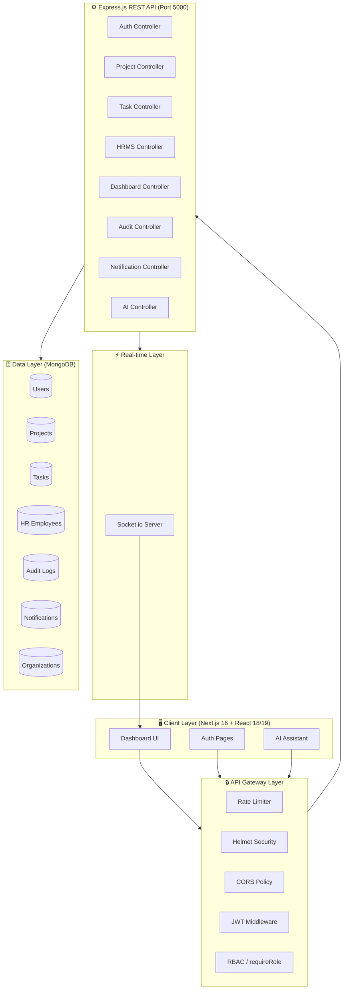
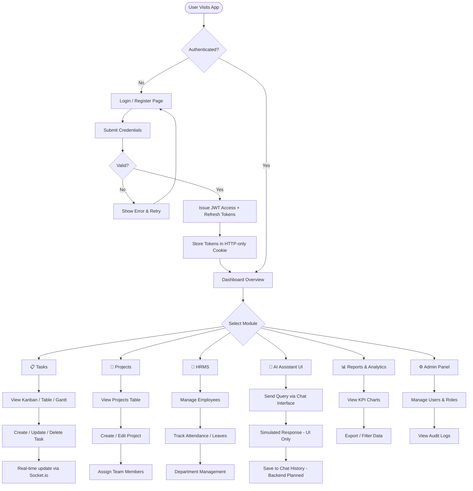
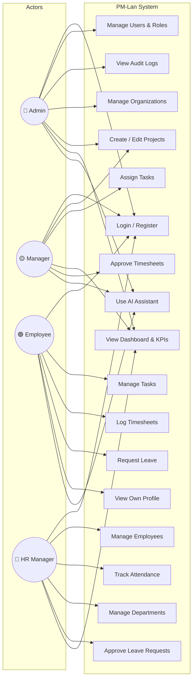
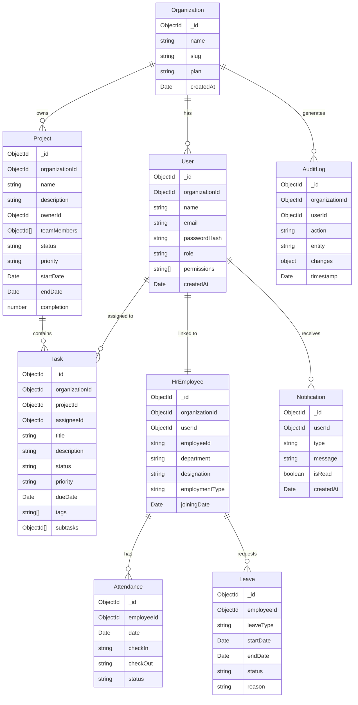

<div align="center">

# 🚀 PM-Lan — Project Intelligence & Governance Platform

**A full-stack, multi-tenant Project Management Tool built for modern engineering teams.**  
Track tasks, manage your workforce, gain AI-powered insights, and govern projects at scale.

[](https://nodejs.org/)
[](https://nextjs.org/)
[](https://mongodb.com/)
[](https://www.typescriptlang.org/)
[](https://docker.com/)
[](LICENSE)

</div>

---

## 📑 Table of Contents

- [Overview](#-overview)
- [Features](#-features)
- [Tech Stack](#-tech-stack)
- [System Architecture](#-system-architecture)
- [Application Flow](#-application-flow)
- [Use Case Diagram](#-use-case-diagram)
- [Database Design](#-database-design)
- [Folder Structure](#-folder-structure)
- [Installation & Setup](#-installation--setup)
- [Environment Variables](#-environment-variables)
- [Screenshots / UI Preview](#-screenshots--ui-preview)
- [Future Enhancements](#-future-enhancements)
- [Contributors](#-contributors)
- [License](#-license)

---

## 🌐 Overview

**PM-Lan** is a multi-tenant **Project Intelligence & Governance Platform** built on a production-ready architecture, designed for engineering teams, HR departments, and project managers. It brings together all critical operational layers — task tracking, human resource management, real-time collaboration, audit trails, and an AI assistant interface — into a single, unified dashboard.

### 🎯 Who Is It For?

| Role | How They Use It |
|------|----------------|
| **Admins** | Manage users, roles, org settings, audit logs |
| **Project Managers** | Plan & track projects, assign tasks, view KPIs |
| **Employees** | View assigned tasks, log timesheets, request leaves |
| **HR Managers** | Manage attendance, departments, employee records |

### 🧠 Core Goals

- Centralize project governance with real-time visibility
- Automate HR workflows (attendance, leave, department management)
- Provide an AI assistant interface for project queries (backend integration planned)
- Maintain security, audit compliance, and multi-tenant isolation

---

## ✨ Features

### ✅ Implemented

#### 📋 Task Management
- Kanban Board with drag-and-drop (powered by `@dnd-kit`)
- Table View and Gantt Chart View for different planning styles
- Task creation with full metadata: priority, assignee, due dates, status, subtasks
- Real-time task status updates and filtering

#### 👥 Employee / HRMS Module
- Employee self-service portal
- Attendance tracking and leave request management
- Department and organizational hierarchy management
- HR admin dashboard with full CRUD operations

#### 🤖 AI Assistant (UI Implemented)
- AI Assistant page is fully implemented within the dashboard
- Chat interface with message bubbles and a sliding conversation history drawer
- Quick-action cards for common project queries
- Dark-themed glassmorphism design
- **Backend AI integration is planned** — see [Future Enhancements](#-future-enhancements)

#### 📊 Dashboard & Analytics
- Overview KPI cards (active projects, tasks at risk, team utilization)
- Activity feed with real-time updates via Socket.io
- Reports module with charts powered by Recharts
- Timesheet management and approval workflows

#### 🔐 Authentication & Access Control
- JWT-based authentication (Access + Refresh tokens, 15m / 7d expiry)
- Role-based access control implemented with ongoing refinement via `requireRole` middleware
- Multi-tenant organization isolation scoped per `organizationId`
- Session management and audit logging
- Bcrypt password hashing (12 salt rounds)

#### 🔍 Search & Filtering
- Global search across projects and tasks
- Filter by status, priority, owner, date range
- Paginated results on all data-heavy views

#### 🛡️ Security & Governance
- Helmet.js for HTTP security headers
- Rate limiting (100 req / 15 min per IP)
- Request validation with `express-validator`
- Comprehensive Audit Log entity tracking all mutations
- File uploads via Multer (max 10MB)

### 🔄 In Progress / Planned

- [ ] OpenAI API backend integration for AI assistant responses
- [ ] Real-time notifications via Socket.io push events
- [ ] Twilio SMS/WhatsApp alerts for critical deadlines
- [ ] Mobile-responsive PWA support

---

## 🛠 Tech Stack

### Frontend
| Technology | Version | Purpose |
|---|---|---|
| Next.js | 16.x | React framework with SSR/SSG |
| React | 18 / 19 | UI library |
| TypeScript | 5.x | Static typing |
| Tailwind CSS | 3.x | Utility-first styling |
| Framer Motion | 12.x | Animations & transitions |
| Recharts | 2.x | Charts and analytics |
| @dnd-kit | 6.x | Drag-and-drop (Kanban) |
| Lucide React | 0.4x | Icon system |
| Socket.io Client | 4.x | Real-time communication |
| next-themes | 0.4.x | Dark/Light mode |

### Backend
| Technology | Version | Purpose |
|---|---|---|
| Node.js | 20+ | Runtime environment |
| Express.js | 4.x | REST API framework |
| MongoDB | 7.x / Atlas | Primary database |
| Mongoose | 8.x | ODM for MongoDB |
| Socket.io | 4.x | WebSocket server |
| jsonwebtoken | 9.x | Authentication tokens |
| Bcryptjs | 2.x | Password hashing |
| Helmet | 7.x | HTTP security |
| Multer | 1.x | File uploads |
| Winston | 3.x | Logging |
| Morgan | 1.x | HTTP request logging |

### DevOps & Tooling
| Tool | Purpose |
|---|---|
| Docker & Docker Compose | Containerized development & deployment |
| Nodemon | Hot-reload for backend development |
| ESLint | Code linting (frontend + backend) |
| Jest + Supertest | Backend unit & integration testing |
| Git | Version control |

---

## 🏗 System Architecture

PM-Lan uses a classic **3-Tier Architecture** with separation of concerns between the presentation layer (Next.js), business logic layer (Express.js API), and data layer (MongoDB).



### Key Architectural Decisions

- **Multi-tenant isolation**: Every database query is scoped by `organizationId` via the `organizationIsolation` middleware
- **Stateless API**: JWT tokens carry user context; no server-side sessions
- **Event-driven updates**: Socket.io pushes real-time activity and notifications to connected clients
- **Centralized error handling**: A global `errorHandler` middleware normalizes all API error responses

---

## 🔄 Application Flow



---

## 👤 Use Case Diagram



---

## 🗄 Database Design

PM-Lan uses **MongoDB** as its primary data store with **Mongoose** ODM. All collections are scoped by `organizationId` for multi-tenancy.



---

## 📁 Folder Structure

```
PM-Lan/
├── 📄 docker-compose.yml          # Docker Compose for full-stack dev
├── 📄 .gitignore
│
├── 🗂️ backend/
│   ├── 📄 Dockerfile
│   ├── 📄 package.json
│   ├── 📄 .env.example            # Environment variable template
│   ├── 📁 logs/                   # Winston log output
│   ├── 📁 uploads/                # Multer file storage
│   └── 📁 src/
│       ├── 📄 server.js           # App entry point, Express + Socket.io init
│       ├── 📁 config/             # DB connection, app config
│       ├── 📁 controllers/        # Business logic
│       │   ├── authController.js
│       │   ├── projectController.js
│       │   ├── taskController.js
│       │   ├── hrmsController.js
│       │   ├── employeeController.js
│       │   ├── dashboardController.js
│       │   ├── timesheetController.js
│       │   ├── notificationController.js
│       │   ├── reportsController.js
│       │   ├── adminController.js
│       │   ├── userController.js
│       │   ├── activityController.js
│       │   └── discussionController.js
│       ├── 📁 middleware/          # Express middleware
│       │   ├── authenticate.js     # JWT verification
│       │   ├── authorize.js        # Permission checks
│       │   ├── requireRole.js      # Role-based guards
│       │   ├── organizationIsolation.js
│       │   ├── errorHandler.js
│       │   ├── upload.js           # Multer config
│       │   └── validators.js       # express-validator rules
│       ├── 📁 models/             # Mongoose schemas
│       │   ├── User.js
│       │   ├── Organization.js
│       │   ├── Project.js
│       │   ├── Task.js
│       │   ├── HrEmployee.js
│       │   ├── Attendance.js
│       │   ├── HrAttendance.js
│       │   ├── Leave.js
│       │   ├── Department.js
│       │   ├── Notification.js
│       │   ├── AuditLog.js
│       │   ├── Timesheet.js
│       │   ├── Session.js
│       │   ├── Activity.js
│       │   ├── Discussion.js
│       │   ├── Permission.js
│       │   └── Role.js
│       ├── 📁 routes/             # Express route definitions
│       │   ├── authRoutes.js
│       │   ├── projectRoutes.js
│       │   ├── taskRoutes.js
│       │   ├── hrmsRoutes.js
│       │   ├── employeeRoutes.js
│       │   ├── dashboardRoutes.js
│       │   ├── timesheetRoutes.js
│       │   ├── notificationRoutes.js
│       │   ├── reportsRoutes.js
│       │   ├── adminRoutes.js
│       │   ├── userRoutes.js
│       │   ├── auditRoutes.js
│       │   ├── activityRoutes.js
│       │   └── discussionRoutes.js
│       ├── 📁 services/           # External service integrations
│       └── 📁 utils/              # Shared utilities & helpers
│
└── 🗂️ frontend/
    ├── 📄 Dockerfile
    ├── 📄 package.json
    ├── 📄 next.config.ts
    ├── 📄 tailwind.config.js
    ├── 📄 tsconfig.json
    ├── 📁 public/                 # Static assets
    └── 📁 src/
        ├── 📁 app/
        │   ├── 📄 layout.tsx      # Root layout
        │   ├── 📄 page.tsx        # Home / redirect
        │   ├── 📁 auth/
        │   │   └── page.tsx       # Login / Register page
        │   └── 📁 dashboard/
        │       ├── 📄 layout.tsx  # Dashboard shell (sidebar + nav)
        │       ├── 📄 page.tsx    # Main dashboard home
        │       ├── 📁 overview/
        │       ├── 📁 projects/
        │       ├── 📁 tasks/
        │       ├── 📁 hrms/
        │       ├── 📁 employee/
        │       ├── 📁 ai/         # AI assistant page
        │       ├── 📁 reports/
        │       ├── 📁 timesheets/
        │       ├── 📁 activity/
        │       ├── 📁 discussions/
        │       ├── 📁 admin/
        │       └── 📁 notif/
        ├── 📁 components/
        │   └── 📁 dashboard/      # Page-specific components
        ├── 📁 hooks/              # Custom React hooks
        └── 📁 lib/               # API client, utils, constants
```

---

## 🚀 Installation & Setup

### Prerequisites

Ensure you have the following installed:

- [Node.js](https://nodejs.org/) `>= 20.0.0`
- [npm](https://www.npmjs.com/) `>= 10.x`
- [MongoDB](https://www.mongodb.com/) (local or [MongoDB Atlas](https://cloud.mongodb.com/))
- [Docker](https://docs.docker.com/get-docker/) *(optional, for containerized setup)*
- [Git](https://git-scm.com/)

---

### Option 1: Manual Setup (Recommended for Development)

#### 1. Clone the Repository

```bash
git clone https://github.com/Jeffrin29/PM-Lan.git
cd PM-Lan
```

#### 2. Configure Backend Environment

```bash
cd backend
cp .env.example .env
```

Open `.env` and fill in your values:

```env
PORT=5000
NODE_ENV=development
MONGODB_URI=mongodb://localhost:27017/pm_lan_db
JWT_ACCESS_SECRET=your_super_secret_access_key
JWT_REFRESH_SECRET=your_super_secret_refresh_key
CORS_ORIGIN=http://localhost:3000
```

#### 3. Install Backend Dependencies & Start

```bash
# Inside /backend
npm install
npm run dev
```

> The backend API will be running at `http://localhost:5000`

#### 4. Install Frontend Dependencies & Start

Open a **new terminal**:

```bash
cd frontend
npm install
npm run dev
```

> The frontend will be running at `http://localhost:3000`

#### 5. Access the App

Open your browser at: **[http://localhost:3000](http://localhost:3000)**

---

### Option 2: Docker Compose Setup

> ✅ Docker setup is fully implemented and ready for use.

#### 1. Clone & Configure

```bash
git clone https://github.com/Jeffrin29/PM-Lan.git
cd PM-Lan
```

Create the backend `.env` file:

```bash
cd backend && cp .env.example .env && cd ..
```

> **Note for Docker environment:** In your frontend `.env`, set:
> ```
> NEXT_PUBLIC_API_URL=http://backend:5000/api
> ```
> For local development (non-Docker), use `http://localhost:5000/api` instead.

#### 2. Build & Start All Services

```bash
docker-compose up --build
```

This starts:
- 🔧 **Backend** on `http://localhost:5000`
- 🖥️ **Frontend** on `http://localhost:3000`

#### 3. Stop Services

```bash
docker-compose down
```

---

## 🔐 Environment Variables

| Variable | Description | Default |
|---|---|---|
| `PORT` | Backend server port | `5000` |
| `NODE_ENV` | Environment (`development`/`production`) | `development` |
| `MONGODB_URI` | MongoDB connection string | `mongodb://localhost:27017/pm_lan_db` |
| `JWT_ACCESS_SECRET` | Secret key for access tokens | *required* |
| `JWT_REFRESH_SECRET` | Secret key for refresh tokens | *required* |
| `JWT_ACCESS_EXPIRES` | Access token expiry | `15m` |
| `JWT_REFRESH_EXPIRES` | Refresh token expiry | `7d` |
| `CORS_ORIGIN` | Allowed frontend origin | `http://localhost:3000` |
| `BCRYPT_SALT_ROUNDS` | Bcrypt hashing rounds | `12` |
| `UPLOAD_DIR` | File upload directory | `uploads` |
| `MAX_FILE_SIZE` | Max upload size (bytes) | `10485760` (10MB) |
| `RATE_LIMIT_WINDOW_MS` | Rate limit window | `900000` (15 min) |
| `RATE_LIMIT_MAX` | Max requests per window | `100` |
| `LOG_LEVEL` | Winston log level | `info` |

> **Frontend**: Set `NEXT_PUBLIC_API_URL=http://localhost:5000/api` in `frontend/.env.local` (local development) or `http://backend:5000/api` when running via Docker Compose.

---

## 🌍 Live URLs (Local)

When running the application locally (manual or Docker setup), the following URLs will be available:

| Service | URL |
|---|---|
| 🖥️ **Frontend** | [http://localhost:3000](http://localhost:3000) |
| ⚙️ **Backend API** | [http://localhost:5000](http://localhost:5000) |
| 📡 **API Base Path** | `http://localhost:5000/api` |

---

## 🖼 Screenshots / UI Preview

> 📸 *Screenshots will be added as the UI stabilizes. Below is the current module coverage:*

| Module | Status |
|---|---|
| 🔐 Login / Register Page | ✅ Complete |
| 📊 Dashboard Overview | ✅ Complete |
| 📋 Tasks — Kanban View | ✅ Complete |
| 📋 Tasks — Table View | ✅ Complete |
| 📋 Tasks — Gantt View | ✅ Complete |
| 📁 Projects Page | ✅ Complete |
| 🤖 AI Assistant Page (UI) | ✅ Complete — Backend Integration Planned |
| 👥 HRMS Module | 🔄 In Progress |
| 👤 Employee Portal | 🔄 In Progress |
| 📈 Reports & Analytics | ✅ Complete |
| 🕐 Timesheets | ✅ Complete |
| 🔔 Notifications | 🔄 In Progress |
| ⚙️ Admin Panel | ✅ Complete |

---

## 🔮 Future Enhancements

### 🤖 AI Module — Planned Scope

The AI Assistant UI is fully implemented. Backend integration is planned as the next major milestone:

- [ ] **OpenAI GPT Backend Integration** — Connect the AI chat interface to the OpenAI API for real responses
- [ ] **Natural Language Project Queries** — Ask the assistant about task status, team load, and deadlines
- [ ] **Predictive Analytics** — ML-based deadline risk scoring and resource utilization forecasting
- [ ] **Automated Reports** — AI-generated weekly/monthly project summaries

### 📡 Real-Time & Collaboration
- [ ] **Live Collaborative Editing** — Multiple users editing project or task details simultaneously
- [ ] **Real-Time Notifications** — Socket.io push events for task assignments, mentions, and deadlines
- [ ] **In-App Discussion Threads** — Comment threads on tasks and projects

### 📲 Communication & Alerts
- [ ] **Twilio SMS / WhatsApp Alerts** — Critical deadline and escalation notifications
- [ ] **Email Notifications** — Digest emails for daily activity summaries

### 📱 Platform & Accessibility
- [ ] **Progressive Web App (PWA)** — Offline support and mobile home screen installation
- [ ] **Mobile-First Responsive Design** — Full mobile UI optimization
- [ ] **Dark/Light Mode Polish** — Full theme coverage across all modules

### 🏗️ Infrastructure
- [ ] **Production-Grade Docker Pipeline** — Multi-stage builds, Nginx reverse proxy, and CI/CD integration
- [ ] **Redis Caching** — Cache dashboard aggregations and frequently accessed data
- [ ] **Elasticsearch** — Full-text search across all entities

---

## 👥 Contributors

| Name | Role | GitHub |
|---|---|---|
| **Jeffrin** | Full Stack Developer | [@Jeffrin29](https://github.com/Jeffrin29) |
| *Open for contributions* | — | — |

> 💡 **Want to contribute?** Fork the repo, make your changes, and open a Pull Request. All contributions are welcome!

---

## 📄 License

This project is licensed under the **MIT License** — see the [LICENSE](LICENSE) file for details.

```
MIT License

Copyright (c) 2026 PM-Lan Team

Permission is hereby granted, free of charge, to any person obtaining a copy
of this software and associated documentation files (the "Software"), to deal
in the Software without restriction, including without limitation the rights
to use, copy, modify, merge, publish, distribute, sublicense, and/or sell
copies of the Software, and to permit persons to whom the Software is furnished
to do so, subject to the following conditions:

The above copyright notice and this permission notice shall be included in
all copies or substantial portions of the Software.
```

---

<div align="center">

**Built with ❤️ by the PM-Lan Team**
*Making project governance smarter, faster, and human.*

⭐ If you found this useful, **star the repo** to support the project!

</div>
